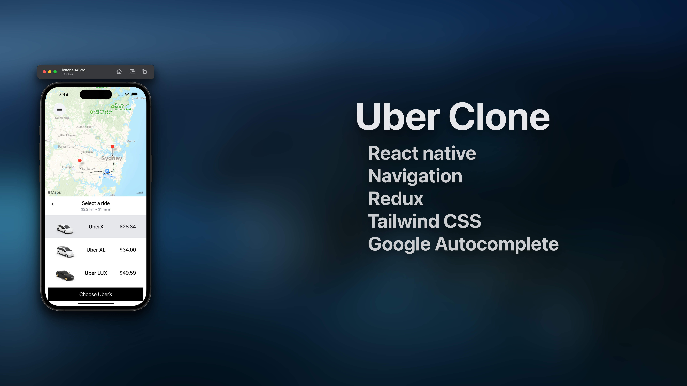

<p align="center"></p>

## Documentation, Installation, and Usage Instructions

## What It Does
This was created to get a feel for React native. It allows a user to select a pickup palce and destination and then using Google's APIs calculates the distance, price and directions for 3 different service levels

## Google maps API key
You will need to get a google maps API key. Ensure to enable
- Autocomplete API
- Distance Matrix
- Directions API

run `cp .env.example .env` and insert your API key.


## Installation

``` bash
yarn 
npx expo start
```

## Credits

- [Sonny Sangha](https://www.youtube.com/watch?v=bvn_HYpix6s&t=7s)

## License

The MIT License (MIT). Please see [License File](LICENSE.md) for more information.